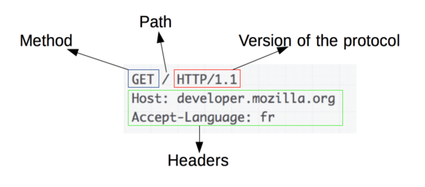
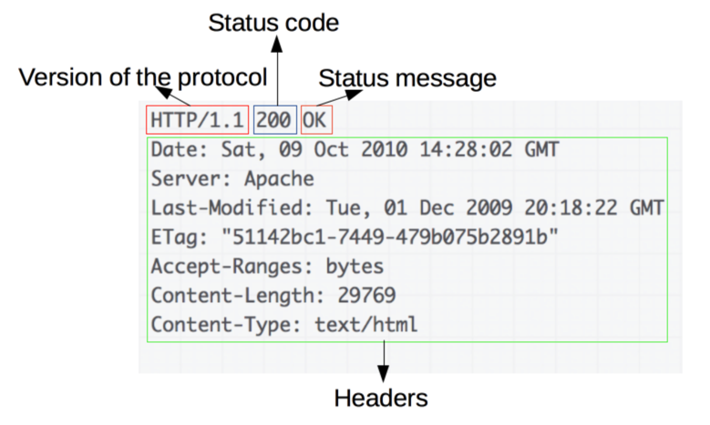

# 🚀 4단계 - 리팩터링

## 요구사항
### 1. HttpRequest 클래스 구현하기
- [RequestLine](https://datatracker.ietf.org/doc/html/rfc2616#section-5.1)


### 2. HttpResponse 클래스 구현하기
- [RFC2616](https://datatracker.ietf.org/doc/html/rfc2616#section-6.1)


### 3. Controller 인터페이스 추가하기
HTTP 요청, 응답을 다른 객체에게 역할을 맡기고 나니까 uri 경로에 따른 if절 분기 처리가 남는다.
if절 분기는 어떻게 리팩터링하는게 좋을까?
컨트롤러 인터페이스를 추가하고 각 분기에 있는 로직마다 AbstractController를 상속한 구현체로 만들어보자.

```java
public interface Controller {
    void service(HttpRequest request, HttpResponse response) throws Exception;
}
```

```java
public abstract class AbstractController implements Controller {

    @Override
    public void service(HttpRequest request, HttpResponse response) throws Exception {
        // http method 분기문
    }

    protected void doPost(HttpRequest request, HttpResponse response) throws Exception { /* NOOP */ }
    protected void doGet(HttpRequest request, HttpResponse response) throws Exception { /* NOOP */ }
}
```
