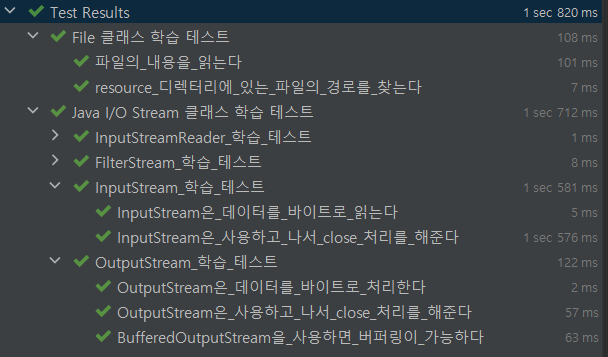
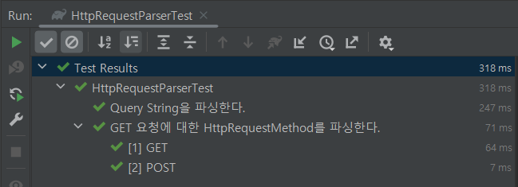

# 만들면서 배우는 스프링
[Next Step - 과정 소개](https://edu.nextstep.camp/c/4YUvqn9V)

## 톰캣 구현하기

### 학습목표
- 웹 서버 구현을 통해 HTTP 이해도를 높인다.
- HTTP의 이해도를 높혀 성능 개선할 부분을 찾고 적용할 역량을 쌓는다.
- 서블릿에 대한 이해도를 높인다.
- 스레드, 스레드풀을 적용해보고 동시성 처리를 경험한다.

### 시작 가이드
1. 미션을 시작하기 전에 파일, 입출력 스트림 학습 테스트를 먼저 진행합니다.
   - [File, I/O Stream](study/src/test/java/study)
   - 나머지 학습 테스트는 다음 강의 시간에 풀어봅시다.
2. 학습 테스트를 완료하면 LMS의 1단계 미션부터 진행합니다.

## 학습 테스트
1. [File, I/O Stream](study/src/test/java/study)
2. [HTTP Cache](study/src/test/java/cache)
3. [Thread](study/src/test/java/thread)

## 1단계 요구사항 정리

- [x] 사전요구사항 - 학습테스트
  - [x] FILE, I/0 STREAM
  - [x] HTTP Cache
  - [x] Thread
- [x] 요구사항 1 - GET 요청
   - [x] GET 요청 RequestLine 파싱
     - [x] Method
     - [x] path
     - [x] protocol
     - [x] version
     - [x] TEST 생성
- [x] 요구사항 2 - POST 요청
  - [x] GET 요청 RequestLine 파싱
    - [x] Method
    - [x] path
    - [x] protocol
    - [x] version
    - [x] TEST 생성
- [x] 요구사항 3 - QUERY STRING 파싱 
  - [x] HTTP 요청 QUERY STRING 데이터 파싱
  - [x] TEST 생성
- [x] 요구사항 4 - ENUM 적용
  - [x] Method 인 GET, POST 적용
- [x] 요구사항 5 - 공통 요구사항
  - [x] HTTP REQUEST 클래스 설계
  - [x] HTTP REQUEST를 파싱하는 책임을 분리
  - [x] 커스텀 예외 생성

## 2단계 요구사항 정리
- [x] 리뷰 반영 
  - [x] Response에 미구현된 것 확인
  - [x] Review 질문 답변
  - [x] GreetingController에 'index.html'에 suffix가 있어야 하는 이유
  - [x] 동시성 문제 코멘트에 대한 정리
  - [x] 상수 네이밍 확인 DELIMITER
  - [x] STREAM 닫지 못한것 확인
  - [x] String.SPLIT PATTERN 객체 생성 주입
  - [x] 코드간 스타일 (상수 + 변수 개행)
- [x] 요구사항 1 - GET /index.html 응답하기
  - [x] Resource를 반환하는 기능 지원
- [x] 요구사항 2 - GET CSS 지원하기
  - [x] Request에 header 추가로 읽어오기 (Content-Type 추가)
  - [x] Response에 header 추가하기 (Content-Type 추가)
- [x] 요구사항 3 - GET QUERY 파싱하기
  - [x] InMemoryUserRepository 사용해서 회원 조회
- [x] 요구사항 4 - 공통 설계 요구사항
  - [x] HTTP RESPONSE를 생성하는 책임을 분리 (Factory)
  - [x] HTTP RESPONSE 도메인 객체 생성 + HEADER 추가
  - [x] HTTP Request에 따른 Resource 맵핑 하는 책임을 가진 ControllerFactoryProvider 생성
  - [x] ControllerFactoryProvider가 url 맵핑 리소스들을 스캐닝해와서 HttpResponse를 만드는 Factory와 연결한다. 
  - [x] Factory가 RequestMethod에 따라 Strategy를 구성해서 Response를 반환합니다.
  - [x] Response Test 생성
  - [x] Request Test 생성

- [x] 피드백 반영
  - [x] 홈페이지 접속 확인
    - STREAM 닫지 못한것 확인 -> Stream을 Manual하게 닫아줌
    - 해당 inputStream을 닫으면서, outputstream도 닫히는 이슈입니다. (try-with-resources로 같이 선언됨)
    - Buffer를 바로 생성해서 Parser로 넘겨주어서 try-with-resources를 사용할 수 있게 변경하였습니다.
  - [x] 사용하지 않는 커멘트 제거
  - [x] log.error 제거하고 log.info로 변경하였습니다.
  - [x] 404 일 경우 null 반환 확인
  - [x] resource static 디렉토리 허용으로 변경하기
  - [x] ContentType 에 대한 enum 생성하기
  - [x] null 반환하는 함수들 제거하기

## 3단계 요구사항 정리
- [x] 요구사항 1 - HTTP Status Code 302
  - [x] 성공 케이스: 302 -> /index.html
  - [x] 실패 케이스: 401.html
- [x] 요구사항 2 - POST 방식으로 회원가입
  - [x] Post 되는것 확인하기
  - [x] Parser 에서 request body parse 하기
  - [x] User 생성하기
- [x] 요구사항 3 - Cookie에 JSESSIONID 값 저장하기
  - [x] HTTP Request Header 구현하기
  - [x] HTTP Request Cookie 구현하기
  - [x] HTTP Response Cookie 구현하기
  - [x] 각각 테스트 하기
- [x] 요구사항 4 - Session 구현하기
  - [x] SessionManager 구현하기
    - [x] 로그인 성공시 Session 객체로 User 저장
    - [x] 이미 로그인시 /login 페이지는 index.html로 리다이렉트 처리한다.
- [] 공통 요구사항
  - [] readAllBytes 의 OOM 이슈로 제거하기
  - [] OOM 을 하지 않는 구현에 대한 테스트 생성하기
  - [x] strategy -> factory provider GET 과 POST에 따라 재구성하기
  - [x] 구성요소에 따른 패키지 분리하기

## 4단계 요구사항 정리
- [] 요구사항 1 - HttpRequest 클래스 구현하기 
  - [] 테스트도 추가하기
- [] 요구사항 2 - HttpResponse 클래스 구현하기
  - [] 테스트도 추가하기
- [] 요구사항 3 - Controller 인터페이스 추가하기
  - [] Controller Interface 주입하기
- [] 피드백 사항
  - [] 사용되지 않는 코드 삭제
  - [] 프로바이더 객체에서 구현체 정보 입력 -> Config 레이어 생성하기
  - [] 팩토리 명명법 변경하기
  - [x] 블럭 생략 제거
  - [] query parsing 책임 strategy에 있는 부분 변경하기
  - [x] 상수와 변수 개행
  - [] Response Header 와 Response 생성로직 추상화 -> HTTP ENTITY
  - [] queryString 에서 map으로 파싱하는 로직을 리팩토링
